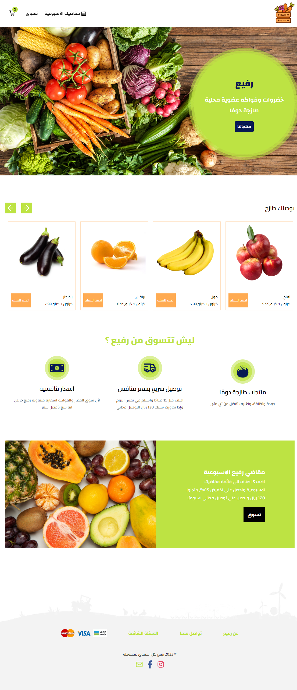
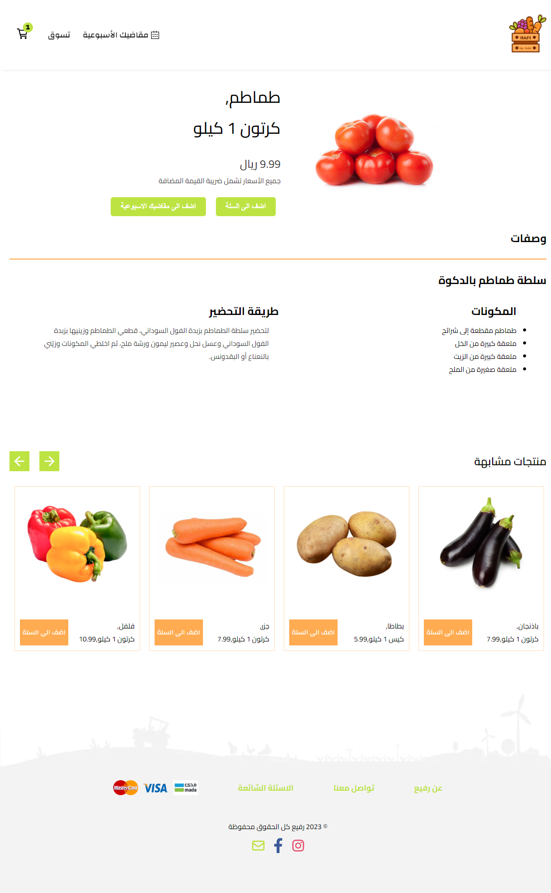
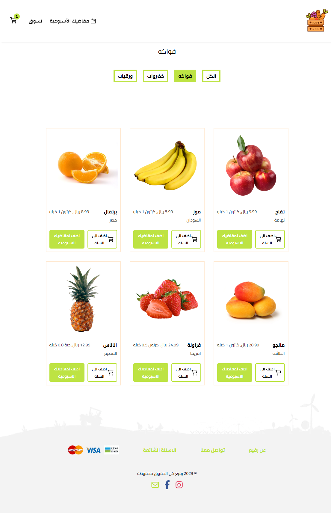
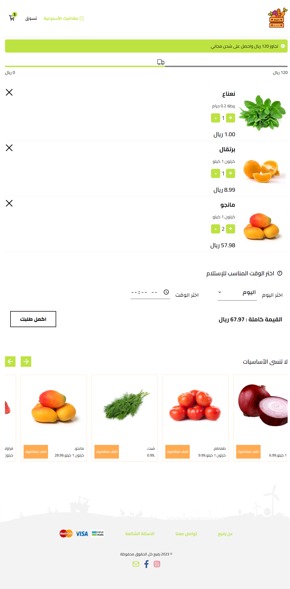

  

Rafi is a minmalist e-commerce website build with React, Redux, and scss, it's a responsive website, and it's a single page application, This website features a modern and intuitive design, with easy-to-use navigation.
this project was inspired by the <a href="https://www.sharbatly.club/">Sharbatly.club</a>  website, and I built this website to practice my skills in React and Redux.
 
Live Demo : &#128073; <a href="">Website Live Demo</a>

<ul>
<li>React</li>
<li>Redux</li>
<li>React Router</li>
<li>SCSS</li>
</ul>
<h2>Screenshot of the projects 📸</h2>

<h1>Home Page : 🏡</h1>

<h1>Product Page : 🎁</h1>

<h1>Catogary Page :</h1> 

<h1>Week List page :</h1>

